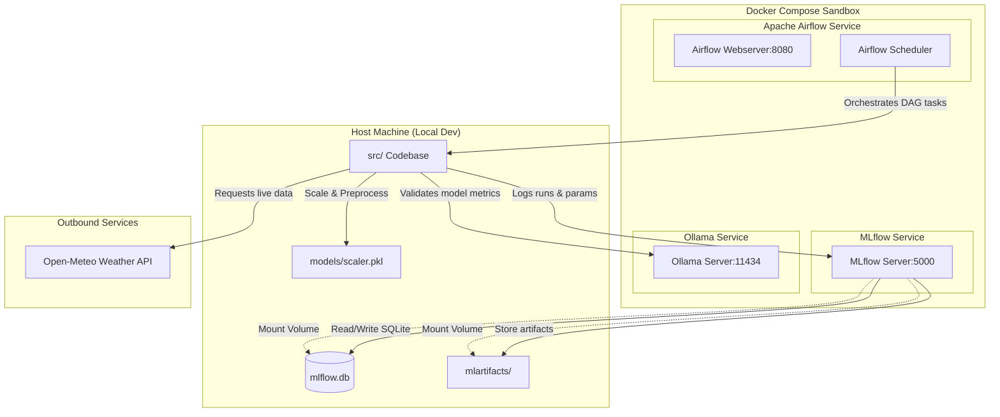
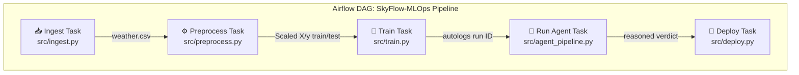
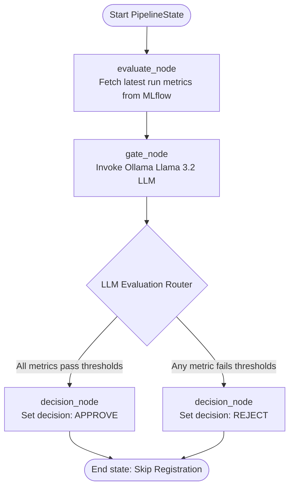
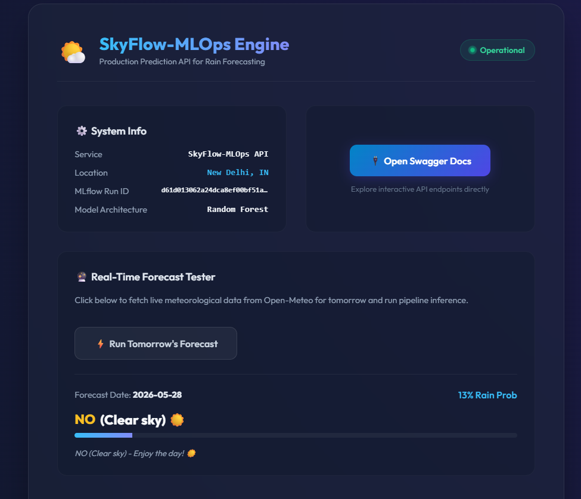
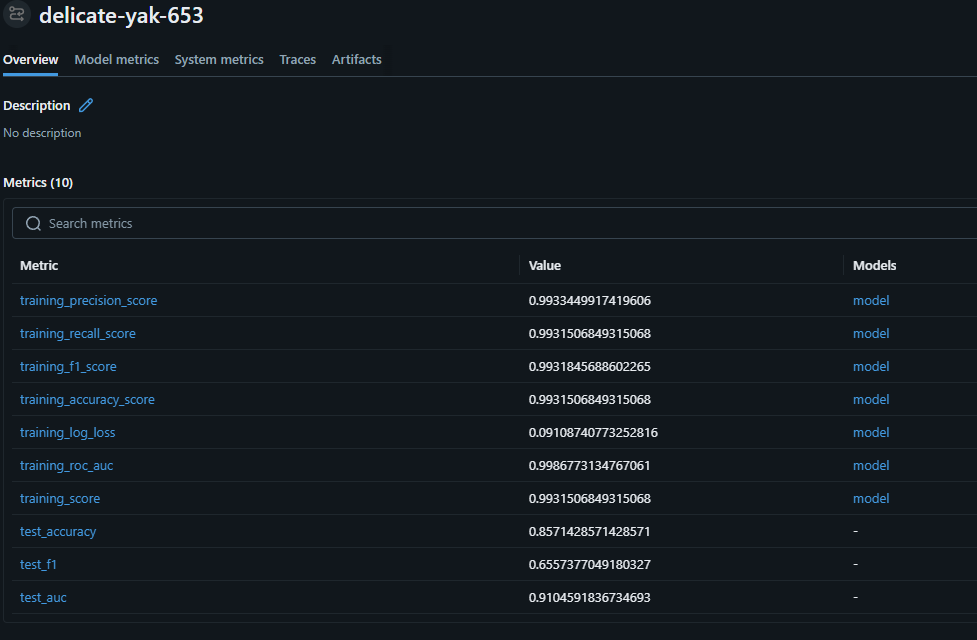
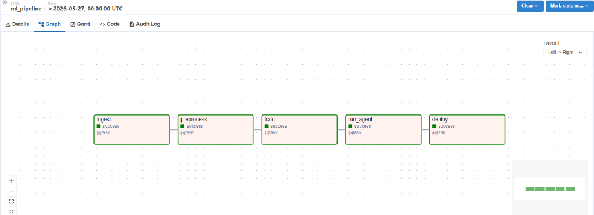

# 🌤️ SkyFlow-MLOps

[](https://mlflow.org/)
[](https://airflow.apache.org/)
[](https://www.docker.com/)
[](https://scikit-learn.org/)

**SkyFlow-MLOps** is a fully containerized, end-to-end MLOps pipeline designed to ingest historical weather data, orchestrate data preparation, train an optimized Random Forest classifier, log runs, and manage deployment readiness for predicting next-day rain in New Delhi.

---

## 🏗️ Architecture & Tech Stack

This pipeline is built as a containerized microservices architecture orchestrated via Docker Compose:

### System Architecture


* **Orchestration:** **Apache Airflow** (Scheduler, Webserver, Init containers) runs the daily pipelines.
* **Tracking & Registry:** **MLflow** handles experiment parameters, metrics, artifact persistence, and model registration.
* **Storage:** Local **SQLite database** (`mlflow.db`) persisted and mapped to the MLflow container to sync runs between local development and Docker.
* **Core ML Engine:** **Scikit-Learn** (Random Forest Classifier).
* **Data Ingestion:** Live **Open-Meteo Historical Archive API** (fetching 2 full years / 17,544 hourly records of atmospheric data completely keyless).

---

## 📊 Pipeline Stages

### Airflow DAG Task Flow


### LangGraph Agent Workflow


The pipeline is split into clean, modular Python modules:

1. 📥 **`src/ingest.py`**: Fetches weather data (temperature, humidity, precipitation, pressure, cloud cover, and dew point) for New Delhi coordinates.
2. ⚙️ **`src/preprocess.py`**: Aggregates hourly weather measurements into daily averages, handles stratified train-test splitting (80/20), and saves data with fitted scaling values.
3. 🧠 **`src/train.py`**: Trains the Random Forest model with class weights balanced for natural rain class imbalance, integrates **MLflow Autologging**, and registers metrics.
4. 🚀 **`src/deploy.py`**: Automated gatekeeper that registers the model to the MLflow Model Registry if test performance passes required validation thresholds.
5. 🤖 **`src/agent_pipeline.py`**: A state-of-the-art AI agent built with **LangGraph** and **Ollama (Llama 3.2)** that acts as an automated deployment gatekeeper, reasoning about model performance metrics to make structured deployment decisions.
6. 🔮 **`src/predict.py`**: Auto-fetches tomorrow's live forecast from the Open-Meteo API, scales features, loads the latest MLflow model, and outputs a formatted rain forecast report.
7. 🔌 **`src/app.py`**: Production FastAPI web service with endpoints to predict rainfall for custom features or automatically fetch and predict tomorrow's weather live!

---

## 📈 Performance Metrics

By training on 2 years of historical daily records ($731$ days) from the Open-Meteo archive API, the model achieves highly robust predictive capabilities:

* **Accuracy:** **`85.71%`**
* **F1 Score:** **`0.6557`** (Highly reliable class identification)
* **ROC-AUC:** **`0.9105`** (Outstanding classification boundary separation)

---

## 🚀 Quick Start (Running Locally)

### 1. Prerequisites
Make sure you have [Docker](https://docs.docker.com/get-docker/) and [Docker Compose](https://docs.docker.com/compose/install/) installed.

### 2. Boot up the Services
Start the Airflow webserver, MLflow UI, and background databases:
```bash
docker-compose up -d
```

### 3. Run the Pipeline Manually
You can run the steps locally in your virtual environment:

```bash
# Set up and activate your virtual environment
python -m venv venv
source venv/bin/activate
pip install -r requirements.txt

# Run the complete pipeline
python src/ingest.py
python src/preprocess.py
python src/train.py
python src/deploy.py
```

### 4. Open the Dashboards
* **MLflow UI:** Open [http://localhost:5000](http://localhost:5000) to view runs, parameters, AUC curves, and registered models.
* **Airflow Webserver:** Open [http://localhost:8080](http://localhost:8080) to orchestrate and schedule the pipeline DAGs.

---

## 🔮 Live Inference & API Serving

### 1. Run Live Forecast Inference
Instantly get tomorrow's rainfall prediction in New Delhi based on live Open-Meteo forecasts:
```bash
python src/predict.py
```

### 2. Serve the model as a REST API (FastAPI)
Launch the microservice API server locally:
```bash
uvicorn src.app:app --reload --port 8000
```
* **Interactive Docs:** Visit [http://localhost:8000/docs](http://localhost:8000/docs) to view the Swagger API UI.
* **Health Check:** `GET http://localhost:8000/`
* **Auto-Predict Tomorrow's Rain:** `POST http://localhost:8000/predict_tomorrow`
* **Custom Prediction:** Send custom features via `POST http://localhost:8000/predict` with JSON body:
  ```json
  {
    "avg_temp": 25.4,
    "max_temp": 31.2,
    "min_temp": 19.8,
    "avg_humidity": 65.2,
    "max_humidity": 85.0,
    "avg_wind": 12.5,
    "max_wind": 22.1,
    "avg_pressure": 1010.5,
    "avg_cloud": 45.0,
    "avg_dew_point": 18.2,
    "month": 5,
    "day_of_year": 145
  }
  ```

---

## 📸 Screenshots & Dashboards

### 1. Interactive FastAPI Web Serving Dashboard


### 2. MLflow Experiment Tracking & Performance Registry


### 3. Apache Airflow Orchestrated DAG Pipeline


